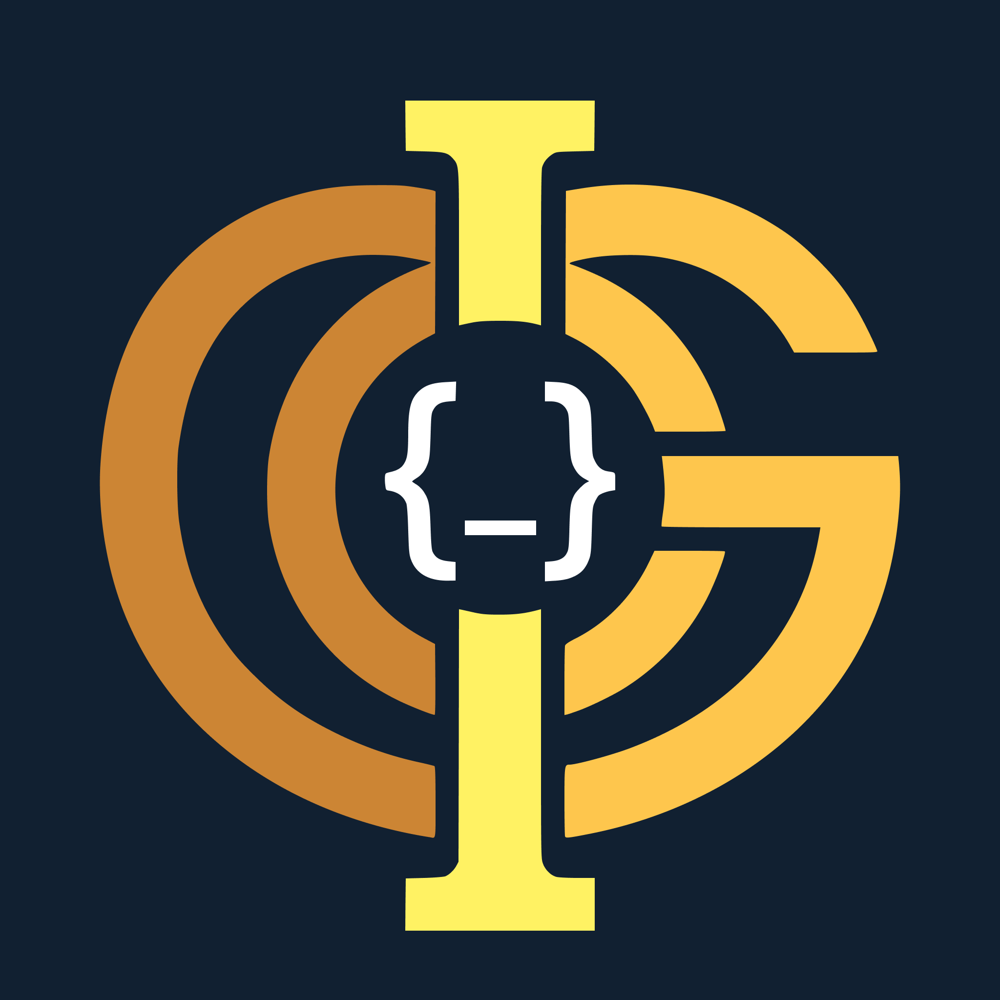

<div align="center">
  
  
  <br/><br/>
  <p><strong>Fight vibe coding. Understand your own code.</strong></p>
</div>

---

**Intellegode** is a VS Code extension that leverages a local Large Language Model to quiz you on code you just wrote or AI-generated—ensuring deep comprehension before you move on. Everything runs strictly local. No cloud telemetry, no subscriptions.

## How It Works

1. Highlight a block of code in your editor.
2. Press `Ctrl+Alt+Q` (Windows/Linux) or `Cmd+Alt+Q` (Mac) to trigger Intellegode.
   - Alternatively: Open the Command Palette (`Ctrl+Shift+P`) and run `Intellegode: Quiz Me`.
3. Answer the comprehension question in the sidebar.
4. Receive immediate, context-aware feedback from the AI to validate your grasp of the logic.

## Prerequisites

- [Node.js](https://nodejs.org/) v18+
- [Ollama](https://ollama.com/) installed natively or via [Docker](https://www.docker.com/)
- [VS Code](https://code.visualstudio.com/) v1.110+

## Installation & Setup

**1. Install the Extension**
Search for **Intellegode** in the VS Code Extensions Marketplace and select Install.

**2. Start Ollama**
Ensure the Ollama server is running in the background. If you installed Ollama natively:
```bash
ollama serve
```

**3. Pull the Language Model**
Intellegode requires the Qwen model to operate. Run the following command in your terminal:
```bash
ollama pull qwen3.5:4b
```

**4. Start Your First Session**
Highlight a snippet of code in your editor and press **Ctrl+Alt+Q** to begin your session.

## Architecture

- **VS Code Extension API** (TypeScript)
- **Ollama** (Local LLM Runtime)
- **Qwen3.5 4B** (Code Comprehension Model)

## Configuration

In VS Code, navigate to **File > Preferences > Settings** and search for `Intellegode` to configure:

- **`intellegode.ollamaUrl`**: Base URL for the Ollama server (Default: `http://localhost:11434`)
- **`intellegode.defaultModel`**: Target model mapping (Default: `qwen3.5:4b`)

### Developer Environment Variables

When running the extension in development mode, the following flags are supported:

- `INTELLEGODE_OLLAMA_FORCE_CPU=1` — Forces CPU-only execution (Beneficial for low-VRAM environments)
- `INTELLEGODE_OLLAMA_REQUEST_TIMEOUT_MS=120000` — Configures the request timeout buffer in milliseconds

## Troubleshooting

### Extension Hangs / System Freezes
**Cause**: Ollama is attempting to load the language model into GPU VRAM but running out of allocation space.
**Solution**: 
If your hardware has 4GB VRAM or less, force CPU mode. You can set the environment variable before launching VS Code from the terminal:
```bash
export INTELLEGODE_OLLAMA_FORCE_CPU=1
```
*Note: CPU-only inference is inherently slower but remains entirely stable on lower-end systems.*

### Connection Refused to Ollama
**Solution**:
1. Verify Ollama is actively running.
2. Confirm Ollama is accessible by running `curl http://localhost:11434/api/tags`.
3. Check that your `intellegode.ollamaUrl` setting correctly resolves to the active Ollama host.

### Model Not Found Error
**Solution**:
The required model has not been downloaded to the Ollama runtime. Pull the required model:
```bash
ollama pull qwen3.5:4b
```

### Request Timeout Error
**Cause**: The model is sustaining a cold-boot load that exceeds the timeout threshold.
**Solution**:
Wait a few seconds for the model to cache into memory and try again. Alternatively, increase the timeout limit via the `INTELLEGODE_OLLAMA_REQUEST_TIMEOUT_MS` variable.

## Roadmap

- [ ] v1 — Active Quizzer (Highlight -> Question -> Feedback)
- [ ] v2 — Concept Debt Tracker
- [ ] v3 — Project Ownership Mapping
- [ ] v4 — Reconstruction Challenges
